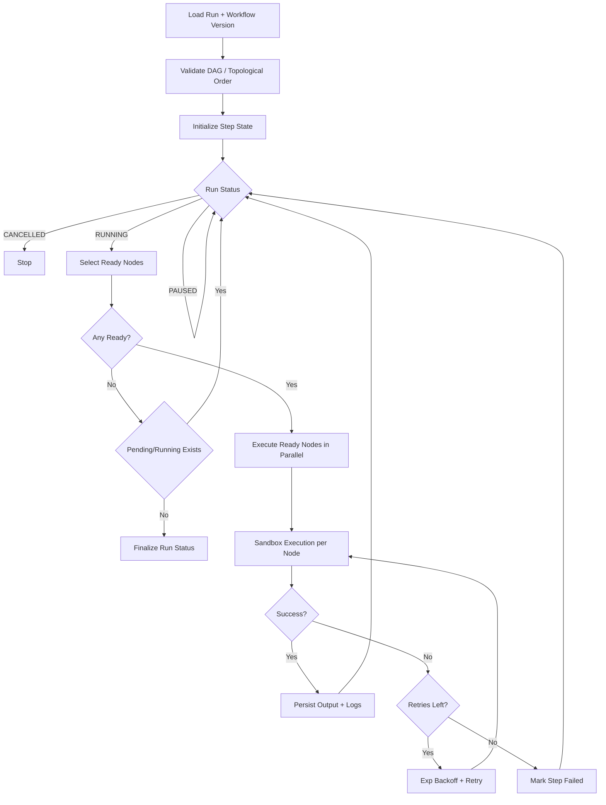

# DAG Engine Design

## Determinism & Idempotency

- Deterministic ordering: ready steps sorted lexicographically by `step.id`.
- Idempotency: persisted `step_states` allows safe resume and prevents duplicate success handling.
- Replay-safe logs: every attempt is persisted with timestamp and duration.
